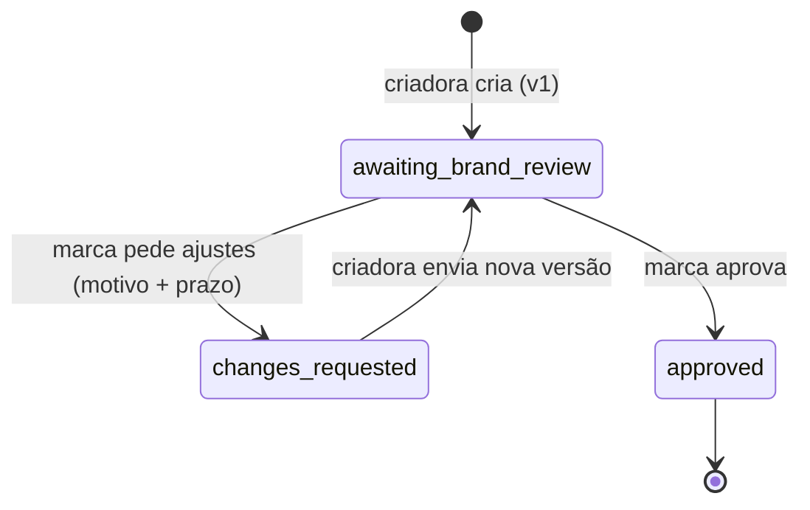

# Revisão de roteiro

API para a marca pedir ajustes em um roteiro (com motivo e prazo) e para a criadora ou o criador enviar outra versão. O roteiro tem versões imutáveis e um estado explícito, e o histórico fica guardado.

## Como rodar

Node 22 ou mais novo.

```bash
npm install
npm run dev          # http://localhost:3000, banco em memória
npm test             # vitest
npm run typecheck
```

Variáveis: `PORT` (padrão 3000) e `DB_PATH` (padrão `:memory:`; passe um caminho de arquivo para manter os dados entre execuções).

O ator vem do cabeçalho `x-actor: brand` ou `x-actor: creator`. É só um substituto de autenticação: quem manda o cabeçalho é acreditado.

## Estados



| status | `awaiting` | marca pode | criadora pode |
|---|---|---|---|
| `awaiting_brand_review` | `brand` | `request_changes`, `approve` | nada |
| `changes_requested` | `creator` | nada | `submit_version` |
| `approved` | `none` | nada | nada |

Toda resposta traz `status`, `awaiting`, `current_version`, `content` e `allowed_actions`. O `allowed_actions` vale para quem fez a chamada, então o cliente não precisa deduzir nada.

## Endpoints

| método e rota | quem | efeito |
|---|---|---|
| `POST /scripts` | creator | cria o roteiro com a v1 (`title`, `content`) |
| `POST /scripts/:id/change-requests` | brand | pede ajustes (`version`, `reason`, `due_date`) |
| `POST /scripts/:id/versions` | creator | envia a próxima versão (`content`) |
| `POST /scripts/:id/approve` | brand | aprova (`version`) |
| `GET /scripts/:id` | ambos | estado atual |
| `GET /scripts/:id/history` | ambos | todas as versões e a linha do tempo |

Erros têm sempre o formato `{ "error": { "code", "message" } }`, com mensagem em pt-BR.

### Exemplos (saídas reais, capturadas com curl)

O servidor dos exemplos rodou com `PORT=3187`; `$ID` é o `id` devolvido na criação.

Criar o roteiro:

```
$ curl -s -X POST localhost:3187/scripts -H 'x-actor: creator' -H 'content-type: application/json' -d @b1.json
HTTP 201
{
  "id": "7e5cfdb7-6b37-4843-8ffe-9a5fa1caa4c5",
  "title": "Campanha Verão",
  "status": "awaiting_brand_review",
  "awaiting": "brand",
  "current_version": 1,
  "content": "Abertura: mostro o produto na mão e falo o nome da marca.",
  "allowed_actions": [],
  "open_change_request": null,
  "approved_version": null,
  "approved_at": null,
  "timezone": "America/Sao_Paulo",
  "created_at": "2026-10-09T15:25:33.181Z"
}
```

`allowed_actions` está vazio porque a criadora não tem o que fazer enquanto a marca analisa. Para a marca viria `["request_changes", "approve"]`.

Pedido sem motivo, sem prazo, com prazo vencido e com data que não existe (corpos em `{"version":1,"reason":...,"due_date":...}`):

```
reason "   "            -> HTTP 422  {"error":{"code":"reason_required","message":"O motivo é obrigatório e não pode ficar em branco."}}
sem due_date            -> HTTP 422  {"error":{"code":"due_date_required","message":"Informe o prazo em `due_date` (YYYY-MM-DD)."}}
due_date "2026-10-08"   -> HTTP 422  {"error":{"code":"due_date_in_past","message":"O prazo já passou. Informe uma data de hoje ou futura (fuso America/Sao_Paulo)."}}
due_date "2026-02-30"   -> HTTP 422  {"error":{"code":"due_date_invalid","message":"`due_date` deve ser uma data válida no formato YYYY-MM-DD, sem horário."}}
```

Estes quatro foram executados em 09/10/2026, por volta de 12:25 em São Paulo.

Pedido válido:

```
$ curl -s -X POST localhost:3187/scripts/$ID/change-requests -H 'x-actor: brand' -H 'content-type: application/json' \
    -d '{"version":1,"reason":"Citar o cupom VERAO10 logo no começo","due_date":"2026-10-12"}'
HTTP 201
{
  "id": "7e5cfdb7-6b37-4843-8ffe-9a5fa1caa4c5",
  "title": "Campanha Verão",
  "status": "changes_requested",
  "awaiting": "creator",
  "current_version": 1,
  "content": "Abertura: mostro o produto na mão e falo o nome da marca.",
  "allowed_actions": [],
  "open_change_request": {
    "number": 1,
    "version": 1,
    "reason": "Citar o cupom VERAO10 logo no começo",
    "due_date": "2026-10-12",
    "due_at": "2026-10-13T02:59:59.999Z",
    "overdue": false,
    "requested_at": "2026-10-09T15:25:33.572Z"
  },
  "approved_version": null,
  "approved_at": null,
  "timezone": "America/Sao_Paulo",
  "created_at": "2026-10-09T15:25:33.181Z"
}
```

`due_at` é o último milissegundo do dia 12 em São Paulo, escrito em UTC (já é dia 13 em UTC).

Nova versão (criadora) e conflitos de aprovação:

```
POST /versions  {"content":"Abertura: mostro o produto na mão, falo a marca e o cupom VERAO10."}
  -> HTTP 201  status "awaiting_brand_review", awaiting "brand", current_version 2

POST /approve {"version":1}   (a v1 já não é a atual)
  -> HTTP 409  {"error":{"code":"stale_version","message":"A versão 1 não é mais a atual. A versão atual é a 2."}}

POST /approve {"version":2}
  -> HTTP 200  status "approved", awaiting "none", approved_version 2, approved_at "2026-10-09T15:25:33.834Z", allowed_actions []

POST /change-requests {"version":2,...}  ou  POST /versions {...}   (depois de aprovado)
  -> HTTP 409  {"error":{"code":"script_approved","message":"O roteiro já foi aprovado e não aceita mais alterações."}}

POST /approve com x-actor: creator
  -> HTTP 403  {"error":{"code":"forbidden_actor","message":"Somente a marca pode executar esta ação."}}
```

Histórico (`GET /scripts/:id/history`), com o bloco `script` e os textos das versões omitidos aqui por repetirem o que está acima:

```
"timeline": [
  { "type": "version_submitted", "at": "2026-10-09T15:25:33.181Z", "actor": "creator", "version": 1,
    "answers_change_request": null, "late": false },
  { "type": "changes_requested", "at": "2026-10-09T15:25:33.572Z", "actor": "brand", "version": 1,
    "change_request": 1, "reason": "Citar o cupom VERAO10 logo no começo", "due_date": "2026-10-12",
    "due_at": "2026-10-13T02:59:59.999Z", "status": "answered" },
  { "type": "version_submitted", "at": "2026-10-09T15:25:33.689Z", "actor": "creator", "version": 2,
    "answers_change_request": 1, "late": false },
  { "type": "approved", "at": "2026-10-09T15:25:33.834Z", "actor": "brand", "version": 2 }
]
```

O `versions` do mesmo endpoint lista `number`, `content` e `submitted_at` de todas as versões, inclusive a v1.

## Regras e decisões

- **Prazo é um dia, não um instante.** `due_date` é `YYYY-MM-DD` (horário, espaços e datas impossíveis como 2026-02-30 dão 422). O prazo vale até o último milissegundo desse dia em `America/Sao_Paulo`. Vale se `agora <= due_at`; o pedido de ajustes com prazo já vencido é recusado (422 `due_date_in_past`).
- **O fuso vem do banco de fusos do Node (Intl), não de um `-03:00` fixo.** `src/domain/civil-date.ts` procura o primeiro instante em que o calendário do fuso mostra o dia seguinte. Isso funciona também para fusos com horário de verão e para o Brasil antes de 2019 (em 04/11/2018 a meia-noite nem existiu). Tem teste para esses casos.
- **Relógio injetado.** O domínio só recebe `Clock`; não chama `Date.now()`. Os testes fixam o relógio.
- **Criadora responde depois do prazo: aceito e registrado.** O pedido passa a `answered_late` e a entrada da versão na linha do tempo ganha `late: true`. Enquanto não responde, o pedido continua aberto e aparece com `overdue: true`. Nada é descartado nem muda o status sozinho.
- **Só a versão atual é analisada.** `version` no corpo é obrigatório em aprovar e pedir ajustes; se não for a atual, 409 `stale_version`.
- **Aprovar só com a versão em análise.** Com ajustes em aberto a marca recebe 409 `changes_pending`: ela mesma pediu a mudança e precisa ver a nova versão. A marca não pode mudar o prazo nem cancelar um pedido aberto.
- **Aprovado é final.** Nova versão, pedido de ajustes e segunda aprovação dão 409 `script_approved`.
- **Ordem das checagens:** 401 (sem ator) -> 403 (papel) -> 404 -> 422 (formato do corpo) -> 409 (estado, versão) -> 422 `due_date_in_past`.
- **Linha do tempo em ordem causal** (v1, pedido sobre v1, v2, ..., aprovação), não por horário. Assim a ordem não quebra se dois eventos tiverem o mesmo instante.
- **Persistência:** `node:sqlite` com o roteiro inteiro como um documento JSON por linha (`src/db.ts`). O agregado sempre é lido e gravado inteiro, então tabelas separadas só dariam mais código. Como o driver é síncrono, ler-alterar-gravar não se intercala entre duas requisições no mesmo processo.
- **Limites:** título 120, conteúdo 50.000, motivo 1.000 caracteres (o motivo é guardado sem espaços nas pontas).

## O que ficou de fora

- Autenticação real e dono do roteiro. Qualquer marca age em qualquer roteiro; o `x-actor` não diz qual marca nem qual criadora.
- Listagem de roteiros, paginação e filtros. Quem cria guarda o `id`.
- Notificações. A criadora precisa consultar para ver o pedido.
- Prorrogar ou cancelar um pedido de ajustes aberto.
- Chave de idempotência. Um reenvio de `POST /versions` depois de timeout recebe 409 e não duplica, mas o cliente precisa saber disso.
- O fuso é uma constante da marca (`America/Sao_Paulo`), não um campo por marca.
- Sem limite de distância para `due_date` (2999-01-01 passa).
- Sem migração do formato do documento JSON.

## O que faria com mais tempo

- Guardar um log de eventos em vez de derivar a linha do tempo do estado, para ter o histórico de prorrogações e cancelamentos.
- Aceitar `based_on_version` no envio da criadora, igual à marca, em vez de depender só do status.
- Permitir à marca prorrogar o prazo (sempre com motivo) e ver se isso deve reabrir um pedido vencido.
- Um teste de propriedade para `startOfDay` contra uma implementação independente de fusos.

## Testes

`npm test` roda 64 testes do vitest, todos com relógio controlado:

- fluxo completo, várias rodadas, histórico e imutabilidade do texto das versões;
- prazo: 23:59:59.999 em SP (02:59:59.999Z do dia UTC seguinte) vale, 00:00:00.000 em SP do dia seguinte não; caso com UTC já no dia 14 e SP ainda no dia 13; envio no último instante (`answered`) e um milissegundo depois (`answered_late`);
- limites do dia por fuso: SP hoje e em 2018, Nova York (dia de 23 horas), Auckland, Kiritimati;
- validação: motivo ausente, vazio ou só espaços; prazo ausente, com horário, formato errado, 30/02, 29/02 em ano comum e bissexto;
- permissões (401, 403, `allowed_actions` por papel), conflitos (`stale_version`, `changes_already_requested`, `changes_pending`, `not_awaiting_creator`, `script_approved`);
- store em arquivo: os dados voltam depois de reabrir o banco.

## Uso de IA

Escrevi o código e os testes com um assistente de código com IA (Claude), que eu dirigi: defini as regras, os estados e os códigos de erro, e ele gerou a maior parte do texto. Depois eu revisei e ajustei:

- Troquei a ordem de leitura nos handlers para o 404 vir antes do 422: um corpo inválido em um roteiro que não existe agora responde `script_not_found`.
- Quebrei de propósito a comparação do prazo (`>` virando `>=` e `dueAt - 1`) e conferi que o teste de 23:59:59.999 falha nos dois casos.
- Conferi que a linha do tempo não depende do relógio: o teste do histórico usa um relógio parado, com todos os eventos no mesmo instante, e a ordem sai pela relação causal entre versão, pedido e aprovação.
- Decidi que a marca não aprova com ajustes em aberto (`changes_pending`) e que o envio atrasado é aceito e marcado, em vez de recusado. Escrevi os dois comportamentos nos testes de prazo e de conflito.
- Tirei os `any` dos testes e adicionei `close()` ao store porque o teste com arquivo falhava no Windows (arquivo ainda aberto).
