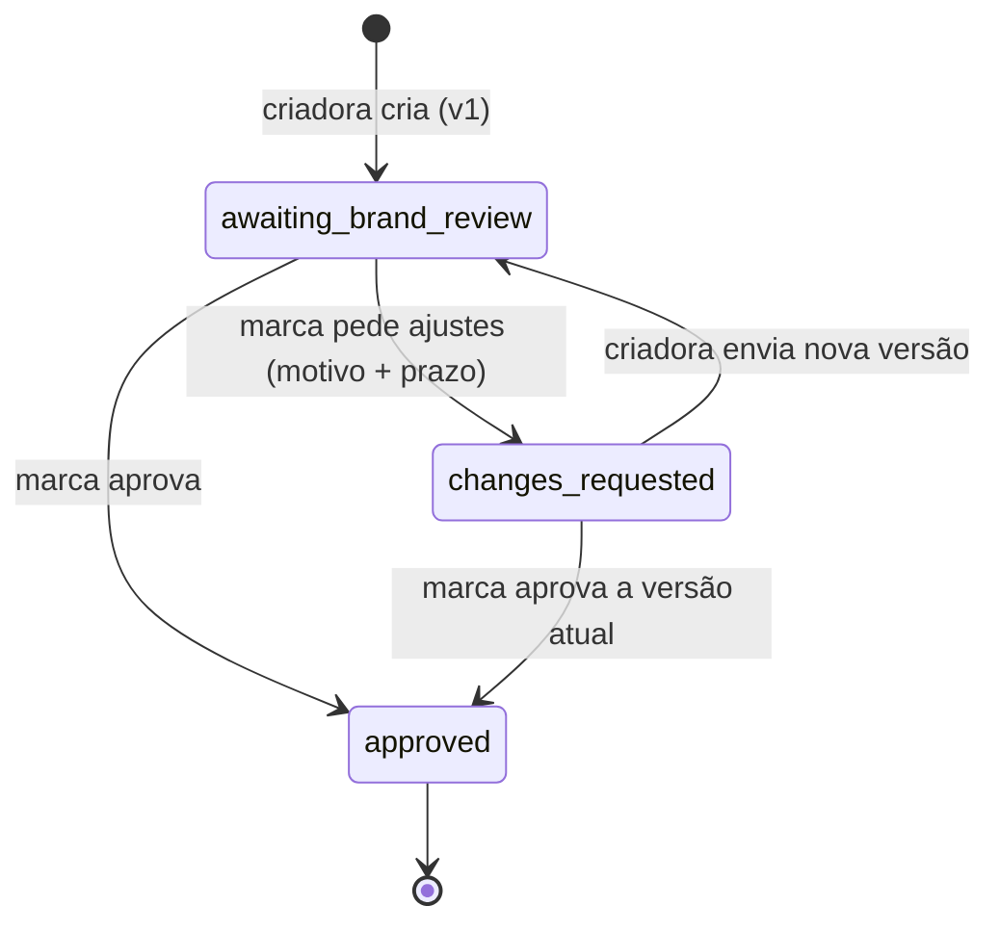

# Revisão de roteiro

API para a marca pedir ajustes em um roteiro (com motivo e prazo) e para a criadora ou o criador enviar outra versão. O roteiro tem versões imutáveis e estado explícito, e o histórico fica guardado.

## Como rodar

Node 22.13 ou mais novo (`node:sqlite` sem flag). Pode aparecer um aviso `ExperimentalWarning` do SQLite no terminal.

```bash
npm install
npm run dev          # http://localhost:3000, banco em memória
npm test
npm run typecheck
```

`PORT` muda a porta. `DB_PATH` aponta para um arquivo SQLite para manter os dados entre execuções (padrão `:memory:`).

O ator vem do cabeçalho `x-actor: brand` ou `x-actor: creator`. É só um substituto de autenticação: quem manda o cabeçalho é acreditado.

## Estados



| status | `awaiting` | marca pode | criadora pode |
|---|---|---|---|
| `awaiting_brand_review` | `brand` | `request_changes`, `approve` | nada |
| `changes_requested` | `creator` | `approve` | `submit_version` |
| `approved` | `none` | nada | nada |

Toda resposta traz `status`, `awaiting`, `current_version`, `content`, `open_change_request` e `allowed_actions`. O `allowed_actions` vale para quem fez a chamada, então o cliente não precisa deduzir nada.

## Endpoints

| rota | quem | corpo |
|---|---|---|
| `POST /scripts` | creator | `title`, `content` |
| `POST /scripts/:id/change-requests` | brand | `version`, `reason`, `due_date` (`YYYY-MM-DD`) |
| `POST /scripts/:id/versions` | creator | `content` |
| `POST /scripts/:id/approve` | brand | `version` |
| `GET /scripts/:id` | ambos | estado atual |
| `GET /scripts/:id/history` | ambos | todas as versões com texto e a linha do tempo |

Erros: `{ "error": { "code", "message" } }`, mensagem em pt-BR.

## Exemplo real

Saídas capturadas com curl em 09/10/2026 (`PORT=3187`). Nas respostas omiti `id`, `title`, `content`, `timezone` e `created_at` quando não mudam.

```
$ curl -s -X POST localhost:3187/scripts -H 'x-actor: creator' -H 'content-type: application/json' \
    -d '{"title":"Campanha Verão","content":"Abertura: mostro o produto na mão e falo o nome da marca."}'
201 {"id":"8ab29fb8-30c7-4f04-96bd-3b2e36ad738f","status":"awaiting_brand_review","awaiting":"brand",
     "current_version":1,"allowed_actions":[],"open_change_request":null,...}

$ curl -s -X POST localhost:3187/scripts/$ID/change-requests -H 'x-actor: brand' -H 'content-type: application/json' \
    -d '{"version":1,"reason":"Citar o cupom VERAO10 logo no começo","due_date":"2026-10-12"}'
201 {"status":"changes_requested","awaiting":"creator","current_version":1,"allowed_actions":["approve"],
     "open_change_request":{"number":1,"version":1,"reason":"Citar o cupom VERAO10 logo no começo",
       "due_date":"2026-10-12","due_at":"2026-10-13T02:59:59.999Z","overdue":false,
       "requested_at":"2026-10-09T15:29:08.209Z"},...}

$ curl -s -X POST localhost:3187/scripts/$ID/versions -H 'x-actor: creator' -H 'content-type: application/json' \
    -d '{"content":"Abertura: mostro o produto na mão, falo a marca e o cupom VERAO10."}'
201 {"status":"awaiting_brand_review","awaiting":"brand","current_version":2,"allowed_actions":[],
     "open_change_request":null,...}

$ curl -s -X POST localhost:3187/scripts/$ID/approve -H 'x-actor: brand' -H 'content-type: application/json' -d '{"version":2}'
200 {"status":"approved","awaiting":"none","current_version":2,"approved_version":2,
     "approved_at":"2026-10-09T15:29:08.476Z","allowed_actions":[],"open_change_request":null,...}
```

`GET /scripts/$ID/history` devolve `versions` (v1 e v2, com o texto de cada uma) e esta `timeline`:

```
version_submitted v1 (creator) -> changes_requested v1 (brand, status "answered", due_at 2026-10-13T02:59:59.999Z)
  -> version_submitted v2 (creator, answers_change_request 1, late false) -> approved v2 (brand)
```

Erros (os 422 e 409 foram vistos no curl; todos têm os testes):

| situação | HTTP | `code` |
|---|---|---|
| `reason` ausente, vazio ou só espaços | 422 | `reason_required` |
| sem `due_date` | 422 | `due_date_required` |
| `due_date` com horário ou inexistente (`2026-02-30`) | 422 | `due_date_invalid` |
| `due_date` já passou em São Paulo (`2026-10-08`) | 422 | `due_date_in_past` |
| prazo que termina a mais de 366 dias de agora (`2999-01-01`) | 422 | `due_date_too_far` |
| aprovar a v1 quando a atual é a v2 | 409 | `stale_version` |
| pedir ajustes de novo na mesma versão | 409 | `changes_already_requested` |
| nova versão sem pedido de ajustes | 409 | `not_awaiting_creator` |
| qualquer escrita depois de aprovado, mesmo com corpo inválido | 409 | `script_approved` |
| ator trocado (criadora aprovando) | 403 | `forbidden_actor` |
| sem `x-actor` | 401 | `actor_invalid` |

## Regras e decisões

- **Prazo é um dia.** Vale até o último milissegundo de `due_date` em `America/Sao_Paulo`: `agora <= due_at`. Um milissegundo depois, o pedido novo é recusado.
- **O fuso vem do banco do Node (Intl), não de `-03:00` fixo.** `src/domain/civil-date.ts` procura o primeiro instante em que o calendário do fuso mostra o dia seguinte. Funciona com horário de verão, inclusive o do Brasil antes de 2019 (em 04/11/2018 a meia-noite nem existiu).
- **Relógio injetado.** O domínio só recebe `Clock`; não chama `Date.now()`.
- **Envio depois do prazo é aceito e marcado.** O pedido vira `answered_late` e a versão aparece com `late: true`. Enquanto a criadora não responde, o pedido fica aberto com `overdue: true`; nada muda sozinho.
- **A marca pode aprovar a versão atual com ajustes em aberto.** Serve para quem mudou de ideia ou para a criadora que não respondeu: o fluxo não trava. O pedido fica registrado como `closed_by_approval`.
- **Só a versão atual é analisada.** `version` no corpo é obrigatório em aprovar e pedir ajustes; outra versão dá 409 `stale_version`.
- **Aprovado é final.** Nova versão, pedido de ajustes e segunda aprovação dão 409 `script_approved`.
- **Linha do tempo em ordem causal** (versão, pedido sobre ela, próxima versão, aprovação), não por horário.
- **Limite de 366 dias** (a partir de agora) no prazo: não está no enunciado; barra datas como 9999-12-31.
- **Persistência:** `node:sqlite`, um documento JSON por roteiro (`src/db.ts`), porque o agregado é lido e gravado inteiro. Ler-alterar-gravar é síncrono, então não se intercala dentro de um processo.

## O que ficou de fora

- Autenticação real e dono do roteiro: qualquer marca age em qualquer roteiro.
- Listagem e paginação de roteiros; quem cria guarda o `id`.
- Notificações: a criadora precisa consultar para ver o pedido.
- Prorrogar ou cancelar um pedido aberto sem aprovar.
- Idempotência (um reenvio de `POST /versions` recebe 409, não duplica) e limite de tamanho do corpo na camada HTTP.
- Fuso por marca (hoje é uma constante) e concorrência entre processos que dividem o mesmo arquivo.

## O que faria com mais tempo

- Log de eventos no lugar de derivar a linha do tempo do estado, para registrar prorrogações e cancelamentos.
- `based_on_version` também no envio da criadora, como na marca.
- Prorrogação de prazo pela marca, sempre com motivo.
- Teste contra uma implementação independente de fusos para `startOfDay`.

## Testes

`npm test`: 69 testes do vitest, todos com relógio controlado. Cobrem o fluxo completo e várias rodadas; histórico e imutabilidade das versões; prazo em 23:59:59.999 de SP (02:59:59.999Z do dia UTC seguinte, vale) e 00:00:00.000 de SP do dia seguinte (não vale); UTC já no dia 14 com SP ainda no 13; envio no último instante (`answered`) e um milissegundo depois (`answered_late`); limites do dia em SP (inclusive 2018), Nova York, Auckland e Kiritimati; validação de motivo e prazo; permissões e `allowed_actions`; conflitos de estado e versão; aprovação com pedido aberto; store em arquivo.

## Uso de IA

O código e os testes foram escritos com um assistente de IA (Claude), que eu dirigi: defini as regras, os estados e os códigos de erro. Depois eu revisei e ajustei:

- Troquei a ordem de leitura nos handlers para o 404 vir antes do 422 quando o JSON é válido, e coloquei motivo e prazo antes de `version` na validação, para que a falta deles nunca seja mascarada.
- Quebrei de propósito a comparação do prazo (`>` virando `>=` e `dueAt - 1`) e conferi que o teste de 23:59:59.999 falha nos dois casos.
- Conferi que a linha do tempo não depende do relógio: o teste do histórico usa relógio parado, com todos os eventos no mesmo instante.
- A primeira versão não deixava a marca aprovar com ajustes em aberto; mudei porque a marca ficava presa se a criadora não respondesse. Agora o pedido fecha como `closed_by_approval`.
- Adicionei o limite de 366 dias no prazo, tirei os `any` dos testes e acrescentei `close()` ao store porque o teste com arquivo falhava no Windows.
